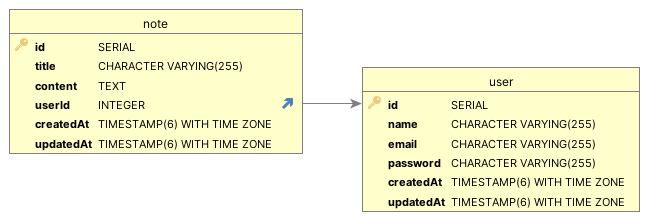

# Веб-приложение "Заметки"

Проект представляет из себя сайт заметок, с реализованной клиентской и серверной частью.

## Структура проекта

Структура клиентской части включает в себя три страницы:
- Home - главная страница, на которую попадает пользователь после авторизации. Она позволяет создавать и просматривать заметки.
- Sign Up - страница регистрации пользователя.
- Sign In - страница авторизации пользователя.

Структура серверной части:
- Контроллеры:
    - noteController - контроллер заметок.
    - userController - контроллер пользователя.
- Миддлвары:
    - authMiddleware - миддлвара проверки авторизации пользователя.
- Базу данных, которая хранит данные о заметках и пользователях.

### Структура базы данных



## Технологии

- [TypeScript](https://www.typescriptlang.org)
- [PostgreSQL](https://www.postgresql.org)
- [React](https://reactjs.org)
- [Express](https://expressjs.com)
- [Sequelize](https://sequelize.org)
- [Visual Studio Code](https://code.visualstudio.com)

## Установка и запуск приложения

1. Клонирование проекта с GitHub можно произвести посредством команды 
```bash
git clone https://github.com/Hel1ax/notes_app
```
2. Для установки приложения необходимо выполнить следующие команды:

    - В папке client выполнить команду `npm install`
    - В папке server выполнить команду `npm install`

3. Для запуска приложения необходимо создать файл `.env` и добавить в него следующие переменные:
    - DB_NAME
    - DB_USER
    - DB_PASSWORD
    - DB_HOST
    - DB_PORT
    - PORT
    - SECRET_KEY

4. Запуск приложения осуществляется посредством выполнения команды `npm start` в папках client и server.